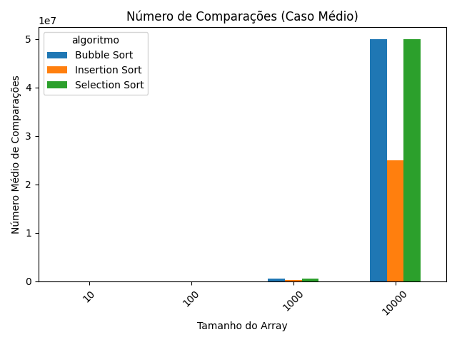
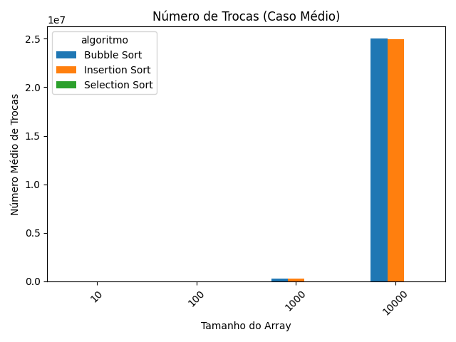

# Projeto Prático: Análise de Desempenho de Algoritmos de Ordenação

**Alunos:** (Jonas Gabriel)
**Professora:** Profa. Silvia Brandão
**Disciplina:** Estruturas de Dados 2

## 1. Introdução

Este projeto prático realiza uma análise comparativa de três algoritmos de ordenação simples: Bubble Sort, Selection Sort e Insertion Sort. O estudo foi conduzido utilizando arrays (listas estáticas) de diferentes tamanhos para avaliar o desempenho de cada método. A comparação abrangeu métricas chave como tempo de execução, número de comparações e número de trocas, analisadas em três cenários distintos: melhor caso (array ordenado), caso médio (array aleatório) e pior caso (array inversamente ordenado).

## 2. Objetivos

Os principais objetivos deste projeto foram:
* Implementar os algoritmos Bubble Sort, Selection Sort e Insertion Sort em Python, aplicados a arrays estáticos.
* Avaliar o desempenho de cada algoritmo nos três cenários propostos (melhor, médio e pior caso).
* Mensurar o tempo de execução, o número total de comparações e o número total de trocas realizadas por cada método.
* Analisar o impacto que a estrutura de dados (arrays) exerce sobre a performance dos algoritmos.

## 3. Metodologia

A análise foi realizada seguindo uma metodologia estruturada em quatro etapas principais.

#### 3.1. Implementação dos Algoritmos
As funções Bubble Sort, Selection Sort e Insertion Sort foram implementadas em Python. Em cada função, foram adicionados contadores para registrar o número de comparações e trocas executadas. A medição do tempo de execução foi feita utilizando a biblioteca `time` do Python.

#### 3.2. Preparação dos Dados
Foram gerados arrays com os seguintes tamanhos: 10, 100, 1.000 e 10.000 elementos. Para cada tamanho, foram criados três tipos de arrays:
* **Melhor Caso:** Array já ordenado em ordem crescente.
* **Caso Médio:** Array preenchido com elementos em ordem aleatória.
* **Pior Caso:** Array ordenado em ordem decrescente.

#### 3.3. Execução dos Testes
Cada algoritmo foi executado sobre os diferentes arrays preparados, registrando-se as métricas de tempo, comparações e trocas. Para o caso médio, as execuções foram repetidas 10 vezes e a média dos resultados foi calculada para garantir maior precisão estatística.

#### 3.4. Ferramentas Utilizadas
* **Linguagem:** Python 3
* **Bibliotecas:**
    * **NumPy:** Para a geração eficiente dos arrays de teste.
    * **Matplotlib:** Para a criação dos gráficos de análise.
    * **Pandas:** Para a manipulação e organização dos dados coletados.

## 4. Resultados Apresentados

Os dados coletados durante a fase de testes foram compilados e visualizados nos gráficos abaixo.

#### 4.1. Tempo de Execução

Os gráficos de linha a seguir comparam o tempo de execução (em segundos) dos três algoritmos em relação ao aumento do tamanho do array para cada um dos cenários. A escala logarítmica foi utilizada em ambos os eixos para melhor visualização da ordem de grandeza.

**Melhor Caso (Array Ordenado)**
.png)

**Caso Médio (Array Aleatório)**
.png)

**Pior Caso (Array Inverso)**
.png)

#### 4.2. Número de Comparações e Trocas (Caso Médio)

Os gráficos de barra abaixo detalham o número de operações (comparações e trocas) realizadas por cada algoritmo no cenário de caso médio, que é o mais comum em aplicações práticas.

**Número de Comparações**


**Número de Trocas**


## 5. Discussão

A análise dos resultados obtidos permite comparar o desempenho empírico dos algoritmos com suas complexidades teóricas conhecidas.

#### 5.1. Análise de Desempenho e Complexidade
Nos cenários de caso médio e pior caso, todos os algoritmos exibiram um crescimento de tempo de execução quadrático ($O(n^2)$). Isso é evidenciado nos gráficos de tempo, onde as linhas crescem acentuadamente, confirmando que o desempenho se degrada rapidamente com o aumento do volume de dados.

A ordem inicial dos dados influenciou expressivamente o desempenho, especialmente no caso do Insertion Sort. No melhor caso (array ordenado), o Insertion Sort demonstrou uma performance muito superior, com complexidade linear ($O(n)$), pois realiza apenas $n-1$ comparações e nenhuma troca. Este resultado confirma a expectativa teórica de que o Insertion Sort é altamente eficiente para dados já ordenados ou quase ordenados.

#### 5.2. Análise das Operações (Comparações e Trocas)

Ao analisar os gráficos de barra para o caso médio, respondemos às perguntas centrais do projeto:

* **a) Qual algoritmo teve mais comparações?**
    * O **Bubble Sort** e o **Selection Sort** realizaram o maior número de comparações, com valores muito próximos entre si.

* **b) Qual algoritmo fez mais trocas?**
    * O **Bubble Sort** e o **Insertion Sort** foram os que mais realizaram trocas. Em contrapartida, o **Selection Sort** se destacou por executar um número drasticamente menor de trocas, confirmando sua principal característica: minimizar as operações de escrita na memória.

* **c) Existe uma relação entre o número de trocas e a eficiência da ordenação?**
    * Sim. Embora o tempo de execução do Selection Sort não tenha sido o melhor, sua eficiência em número de trocas o torna uma escolha preferível em cenários onde a operação de escrita é computacionalmente cara.

## 6. Conclusão

Este projeto permitiu compreender na prática as diferenças de desempenho entre os algoritmos de ordenação simples. Foi verificado que, embora todos possuam uma complexidade de tempo média de $O(n^2)$, suas características operacionais os tornam mais ou menos adequados para diferentes contextos. O Insertion Sort se mostrou a melhor opção para conjuntos de dados pequenos ou parcialmente ordenados, enquanto o Selection Sort é a escolha ideal quando o número de trocas deve ser minimizado. A análise reforça a importância de se escolher o algoritmo adequado com base na estrutura dos dados e nos requisitos da aplicação para garantir a eficiência.

## 7. Como Executar o Projeto

1.  **Pré-requisitos:** Ter o Python 3 instalado.
2.  **Clonar o Repositório:**
    ```bash
    git clone (URL do seu repositório)
    cd (nome-da-pasta-do-projeto)
    ```
3.  **Criar e Ativar o Ambiente Virtual:**
    ```bash
    # Criar
    python -m venv venv
    # Ativar (Windows)
    .\venv\Scripts\activate
    # Ativar (macOS/Linux)
    source venv/bin/activate
    ```
4.  **Instalar as Dependências:**
    ```bash
    pip install -r requirements.txt
    ```
5.  **Executar a Análise:**
    ```bash
    python main.py
    ```
    Os resultados, incluindo os gráficos e um arquivo `resultados_completos.csv`, serão salvos na pasta `results/`.